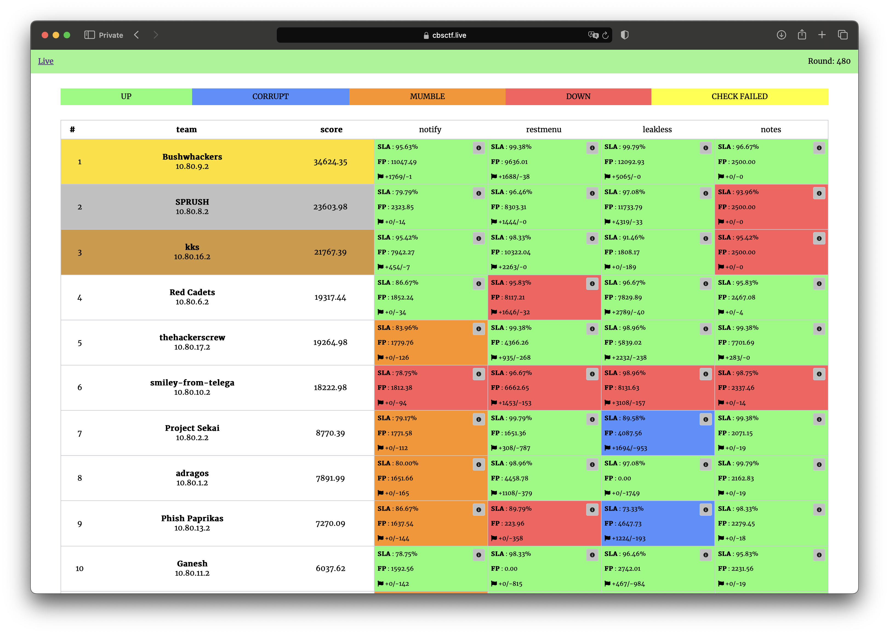

# BRICS+ CTF 2023 | Finals

The contest was held on November 11, 2023. Services and infrastructure by C4T BuT S4D. Organized by ITMO University and ACISO.

Repository contains source code of services, checkers and exploits.

## Results

[Full scoreboard](scoreboard/full.png)

## Services

| Service                            | Language      | Checker                       | Sploits                      | Authors                                                                             |
|------------------------------------|---------------|-------------------------------|------------------------------|-------------------------------------------------------------------------------------|
| **[notify](services/notify/)**     | Rust          | [Checker](checkers/notify/)   | [Sploits](sploits/notify/)   | [@renbou](https://github.com/renbou) |
| **[restmenu](services/restmenu/)** | Kotlin & Java | [Checker](checkers/restmenu/) | [Sploits](sploits/restmenu/) | [@jnovikov](https://github.com/jnovikov)                                            |
| **[leakless](services/leakless/)** | Go            | [Checker](checkers/leakless/) | [Sploits](sploits/leakless/) | [@falamous](https://github.com/falamous)                                    |
| **[notes](services/notes/)**       | Python & C    | [Checker](checkers/notes/)    | [Sploits](sploits/notes/)    | [@user39043346](https://github.com/user39043346)                                             |

## Infrastructure

- DevOps: [@pomo_mondreganto](https://github.com/pomo-mondreganto)
- Checksystem: [ForcAD](https://github.com/pomo-mondreganto/ForcAD)

## Writeups

- [notify](/sploits/notify/)
- [restmenu](/sploits/restmenu/)
- [leakless](/sploits/leakless/)
- [notes](/sploits/notes/)
